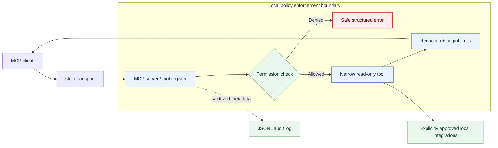

<div align="center">

# Local MCP Toolbox

### Inspect approved local systems through a strict zero-trust boundary.

A local [Model Context Protocol](https://modelcontextprotocol.io/) server for checking files, Git changes, application logs, container health, and Python environments. You choose what it can inspect. Every request is authorized, sensitive output is redacted, results are bounded, and activity is audited.

[](https://github.com/chriswayneh/local-mcp-toolbox/releases)
[](https://www.python.org/)
[](https://github.com/chriswayneh/local-mcp-toolbox/actions/workflows/quality.yml)
[](https://github.com/chriswayneh/local-mcp-toolbox/actions/workflows/security.yml)
[](LICENSE)
[](docs/security-model.md)

**Current release:** [v1.5.2](https://github.com/chriswayneh/local-mcp-toolbox/releases/tag/v1.5.2). The v1.5 scope is complete. See the [release contract and acceptance record](docs/release-1.5.md).

[Quick Start](#quick-start) · [Tools](#what-you-get) · [Security](#security-by-design) · [How It Works](#how-it-works) · [Connect a Client](#connect-a-client) · [Architecture](#architecture) · [Demo](#see-it-safely) · [Roadmap](ROADMAP.md) · [Contributing](CONTRIBUTING.md)

</div>

---

## What This Is

Local MCP Toolbox supports development, security review, and troubleshooting workflows that need evidence without broad machine authority.

Use it to review changes in an approved repository, investigate recurring log errors, or check an unhealthy container. Each integration requires explicit configuration. Returned evidence helps you investigate; it does not establish a root cause by itself.

The exposed tools cannot edit your files, commit code, restart containers, execute arbitrary commands, or mutate remote systems. The server writes only its own security audit records. It runs locally and connects to an MCP client; there is no separate dashboard.

## What You Get

| Capability | What it does | Security boundary |
| --- | --- | --- |
| System | Safe host metadata and developer-tool availability | No environment variables, usernames, process data, or executable paths |
| Filesystem | Approved-root listing, metadata, and text inspection | Canonical containment, sensitive-path blocklist, extension allowlist, bounded reads |
| Git | Repository status, branch, commits, and diff summaries | Explicit repository allowlist; fixed, non-interactive Git commands |
| GitHub | Repository, issue, and pull-request metadata | External-network opt-in, exact repository allowlist, fixed API origin, bounded GET requests |
| Python environments | Static virtual-environment dependency metadata audit | Separate roots, link-free fixed paths, no interpreter, Pip, subprocess, import, or network execution |
| Metrics | Aggregate request outcomes and latency | In-process counters only; no arguments, responses, identifiers, or secrets |
| Docker | Opt-in container metadata, health, and bounded logs | Official SDK only; no lifecycle, exec, mount, environment, or command access |
| Logs | Tails, literal search, and deterministic error grouping | Dedicated approved roots, output limits, and central redaction |
| Security | Bandit availability and normalized scan findings | Fixed scanner invocation; no user-controlled command arguments or fixes |
| Infrastructure | Project-type detection and top-level configuration inventory | Separate approved roots; no recursive content inspection |
| Incidents | Timestamped evidence and deterministic summaries | Read-only, bounded observations: never root-cause claims |
| Audit | Sanitized JSONL accountability trail | Shape-only request summaries, retention, and size limits |

For parameters, output schemas, and every individual guardrail, see the full [tool catalog](docs/tools.md).

## Quick Start

### Requirements

- Python 3.12 or later
- An MCP-capable client for connection after the server is validated

The default `restricted` profile is intentionally safe: it starts with no approved filesystem roots and no optional integrations.

### Windows (PowerShell)

```powershell
git clone https://github.com/chriswayneh/local-mcp-toolbox.git
Set-Location local-mcp-toolbox
python -m venv .venv
.\.venv\Scripts\python -m pip install -e ".[dev,docker]"
.\.venv\Scripts\local-mcp-toolbox doctor --config config\restricted.yml
```

### macOS / Linux

```bash
git clone https://github.com/chriswayneh/local-mcp-toolbox.git
cd local-mcp-toolbox
python3 -m venv .venv
.venv/bin/python -m pip install -e ".[dev,docker]"
.venv/bin/local-mcp-toolbox doctor --config config/restricted.yml
```

`doctor` checks configuration and prerequisites without changing them. Review any reported issues, then [connect your client](#connect-a-client) using the supplied template. The client starts the server when needed.

For a manual startup check, run `local-mcp-toolbox serve --config config/restricted.yml` using the executable in your virtual environment. It waits for MCP messages and does not open a browser. Press Ctrl+C to stop it before letting your client start its own instance.

The default profile has no approved file roots or optional integrations. Start by asking your client to call `toolbox_server_status`. Then follow [getting started](docs/getting-started.md) to grant only the access you need. The install above includes development and Docker support; Docker itself is optional and remains disabled until configured.

## Security by Design

The design applies zero trust and least privilege: each request is checked against local policy, and integrations receive only the access you explicitly configure.

| Control | Protection |
| --- | --- |
| Deny by default | The restrictive profile has no approved filesystem roots or integrations. |
| Approved roots | Canonical containment blocks arbitrary filesystem access and escape paths. |
| Read-only surface | No generic shell, mutation, commit, lifecycle, or remote-execution tool is registered. |
| Fixed subprocesses | External binaries use fixed argument templates, `shell=False`, scrubbed environments, timeouts, and output caps. |
| Central redaction | PEM blocks, credentials, cookies, authorization headers, connection strings, and optional privacy identifiers are redacted before output. |
| Output bounds | File reads, collections, subprocess output, and responses are size-limited. |
| Sanitized audit | Requests record safe metadata, actual outcomes, and redaction counts. Raw secrets and tool output are excluded. |
| Explicit integrations | GitHub, Git, Docker, logs, scanners, infrastructure, and incident tools must be configured intentionally. |
| Untrusted evidence | Retrieved files, logs, commit messages, and metadata are treated as untrusted data. |

Read the [security model](docs/security-model.md), [threat model](docs/threat-model.md), and the security-focused [architecture decisions](docs/adr/) for the complete rationale.

## How It Works

1. An MCP client requests one registered tool.
2. The toolbox validates typed inputs and bounded parameters.
3. Permissions, approved roots, and integration allowlists are checked.
4. A narrow read-only operation collects the permitted data.
5. Results are redacted and bounded before they cross the MCP boundary.
6. Sanitized request metadata is recorded in the audit log.
7. The client receives a safe structured result or error.

## Connect a Client

The repository includes stdio configuration templates for the clients below. Template parsing and the installed server's launch contract are tested; individual desktop application versions are not certified. Adding a client entry lets the client start the process: it does **not** grant the server broader permissions.

| Client | Copy-ready template |
| --- | --- |
| Codex | [`examples/codex/config.toml`](examples/codex/config.toml) |
| Claude Desktop | [`examples/claude-desktop/claude_desktop_config.json`](examples/claude-desktop/claude_desktop_config.json) |
| Claude Code | [`examples/claude-code/.mcp.json`](examples/claude-code/.mcp.json) |
| Visual Studio Code | [`examples/vscode/mcp.json`](examples/vscode/mcp.json) |

Replace the intentionally unresolved paths, then configure the smallest local policy that serves the task. See [client configuration](docs/client-configuration.md) for exact installation notes and the important separation between client startup and server authorization.

## See It Safely

This project is designed for evidence, not a dashboard. The [synthetic demo walkthrough](docs/demo-walkthrough.md) provides a reproducible way to see the policy boundary in action without real credentials, repositories, production logs, or a host Docker socket.

It demonstrates a safe inspection sequence:

```text
toolbox_server_status          → verify the server and active profile
logs_tail_file                 → view redacted synthetic log evidence
logs_error_summary             → group observed errors without causal claims
infra_detect_project_types     → inspect demo project metadata
docker_unhealthy_containers    → observe an intentionally unhealthy demo service
```

The demo’s fabricated token is redacted, disabled integrations return a structured denial, and its audit trail contains sanitized metadata only. Follow the [walkthrough](docs/demo-walkthrough.md) to run it locally.

## Architecture



All retrieved content remains untrusted data. The full component model and trust-boundary discussion live in [architecture](docs/architecture.md).

## Repository Structure

```text
src/mcp_toolbox/  MCP server, tool modules, permissions, redaction, audit, config, and CLI
tests/            Unit, integration, and security regression tests
config/           Restricted, standard, and container policy profiles
docs/             Architecture, threat model, operating guides, ADRs, and tool reference
examples/         MCP client configuration templates
demo/             Synthetic services, logs, and intentionally insecure test fixtures
.github/          CI, security, documentation, release, Dependabot, and contribution templates
```

## Documentation

| Document | Purpose |
| --- | --- |
| [Architecture](docs/architecture.md) | System design, components, and data flow |
| [Security Model](docs/security-model.md) | Controls and trust boundaries |
| [Threat Model](docs/threat-model.md) | Threat analysis and mitigations |
| [Version 1.5 Security Review](docs/security-review-1.5.md) | Findings, remediation, verification, and residual responsibilities |
| [Permissions](docs/permissions.md) | Authorization sequence and profile behavior |
| [Tool Catalog](docs/tools.md) | Inputs, outputs, and module-level guardrails |
| [Client Configuration](docs/client-configuration.md) | Codex, Claude, and VS Code setup |
| [Authenticated HTTP](docs/http-transport.md) | Optional loopback transport and bearer-token controls |
| [Docker](docs/docker.md) | Hardened container profiles and socket-proxy guidance |
| [Demo Walkthrough](docs/demo-walkthrough.md) | Synthetic end-to-end policy demonstration |
| [CI and Release](docs/ci-and-release.md) | Quality, security, docs, package, and release controls |
| [Release Contract](docs/release-1.5.md) | Supported v1.5 scope, acceptance evidence, operations, and limitations |
| [Roadmap](ROADMAP.md) | Completed v1.5 scope and optional future proposals |

## Project Status

Version 1.5 adds allowlisted GitHub inspection, content-free runtime metrics, a static [Python environment auditor](docs/environment-auditor.md), authenticated loopback HTTP, crash-safe audit rotation, and hardened release controls. Kubernetes inspection and generation features were removed after security review because their effective behavior could not satisfy the inspection-only contract.

The v1.5 feature scope is complete. Version 1.5.2 closes default-parameter and container setup defects without adding capabilities. Support is limited to the local inspection contract in the [acceptance record](docs/release-1.5.md), not a hosted service, multi-user security boundary, or production availability guarantee. Versions 2 through 4 are optional proposals, not unfinished release requirements.

## Contributing and Security

Contributions are welcome when they preserve the project’s least-privilege model. Start with [CONTRIBUTING.md](CONTRIBUTING.md), use the repository templates for bugs and feature proposals, and report vulnerabilities through the process in [SECURITY.md](SECURITY.md).

---

## License

Licensed under the MIT License. Use it, fork it, modify it, or build something of your own. See [LICENSE](LICENSE) for the terms.

---

If this project helped you, a ⭐ is appreciated.

## Built with

[Python](https://www.python.org/) · [Model Context Protocol](https://modelcontextprotocol.io/) · [MCP Python SDK](https://github.com/modelcontextprotocol/python-sdk) · [Pydantic](https://docs.pydantic.dev/) · [Typer](https://typer.tiangolo.com/) · [Docker](https://www.docker.com/)

<br>

<p align="center">
  <strong>Inspect local systems with explicit access, bounded evidence, and a clear audit trail.</strong>
</p>
