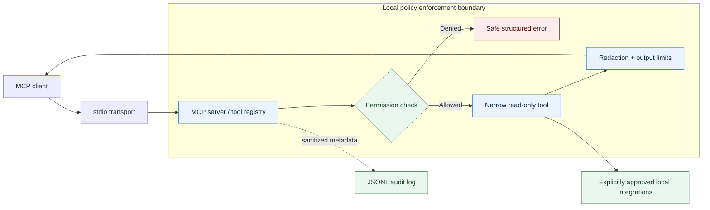

<div align="center">

# Local MCP Toolbox

### Secure, local-first visibility for AI-assisted development—without unrestricted machine access.

A read-only [Model Context Protocol](https://modelcontextprotocol.io/) server that gives AI clients narrowly scoped, auditable access to developer-environment signals: system metadata, approved files, repositories, logs, containers, scanners, and incident evidence.

[](https://github.com/chriswayneh/local-mcp-toolbox/releases)
[](https://www.python.org/)
[](https://github.com/chriswayneh/local-mcp-toolbox/actions/workflows/quality.yml)
[](https://github.com/chriswayneh/local-mcp-toolbox/actions/workflows/security.yml)
[](LICENSE)
[](docs/security-model.md)

**Current release:** [v1.0.0](https://github.com/chriswayneh/local-mcp-toolbox/releases/tag/v1.0.0) — stable read-only core

[Quick Start](#quick-start) · [How It Works](#how-it-works) · [Tools](#what-you-get) · [Security](#security-by-design) · [Architecture](#architecture) · [Demo](#see-it-safely) · [Roadmap](ROADMAP.md) · [Contributing](CONTRIBUTING.md)

</div>

---

## What This Is

AI assistants are useful when they can inspect the environment around a problem. A generic shell tool or unrestricted Docker socket, however, turns that useful visibility into a high-privilege control plane.

Local MCP Toolbox takes a different path: it exposes a small set of typed, read-only MCP tools behind explicit policy checks. An operator chooses the approved roots and integrations; the server validates the request, collects only bounded data, redacts sensitive material, records sanitized audit metadata, and returns structured evidence to the client.

The result is a practical way to connect MCP-capable clients to local developer signals without treating client access as host access.

## What You Get

| Capability | What it does | Security boundary |
| --- | --- | --- |
| System | Safe host metadata and developer-tool availability | No environment variables, usernames, process data, or executable paths |
| Filesystem | Approved-root listing, metadata, and text inspection | Canonical containment, sensitive-path blocklist, extension allowlist, bounded reads |
| Git | Repository status, branch, commits, and diff summaries | Explicit repository allowlist; fixed, non-interactive Git commands |
| Docker | Opt-in container metadata, health, and bounded logs | Official SDK only; no lifecycle, exec, mount, environment, or command access |
| Logs | Tails, literal search, and deterministic error grouping | Dedicated approved roots, output limits, and central redaction |
| Security | Bandit availability and normalized scan findings | Fixed scanner invocation; no user-controlled command arguments or fixes |
| Infrastructure | Project-type detection and top-level configuration inventory | Separate approved roots; no recursive content inspection |
| Incidents | Timestamped evidence and deterministic summaries | Read-only, bounded observations—never root-cause claims |
| Audit | Sanitized JSONL accountability trail | Shape-only request summaries, retention, and size limits |

For parameters, output schemas, and every individual guardrail, see the full [tool catalog](docs/tools.md).

## Security by Design

The security model is the product boundary, not a feature bolted on afterward.

| Control | Protection |
| --- | --- |
| Deny by default | The restrictive profile has no approved filesystem roots or integrations. |
| Approved roots | Canonical containment blocks arbitrary filesystem access and escape paths. |
| Read-only surface | No generic shell, mutation, commit, lifecycle, or remote-execution tool is registered. |
| Fixed subprocesses | External binaries use fixed argument templates, `shell=False`, scrubbed environments, timeouts, and output caps. |
| Central redaction | PEM blocks, credentials, cookies, authorization headers, connection strings, and optional privacy identifiers are redacted before output. |
| Output bounds | File reads, collections, subprocess output, and responses are size-limited. |
| Sanitized audit | Requests record safe metadata, actual outcomes, and redaction counts—not raw secrets or tool output. |
| Explicit integrations | Git, Docker, logs, scanners, infrastructure, and incident tools must be configured intentionally. |
| Untrusted evidence | Retrieved files, logs, commit messages, and metadata are data—not instructions. |

Read the [security model](docs/security-model.md), [threat model](docs/threat-model.md), and the security-focused [architecture decisions](docs/adr/) for the complete rationale.

## How It Works

1. An MCP client requests one registered tool.
2. The toolbox validates typed inputs and bounded parameters.
3. Permissions, approved roots, and integration allowlists are checked.
4. A narrow read-only operation collects the permitted data.
5. Results are redacted and bounded before they cross the MCP boundary.
6. Sanitized request metadata is recorded in the audit log.
7. The client receives a safe structured result or error.

## Quick Start

### Requirements

- Python 3.12 or later
- An MCP-capable client for connection after the server is validated

The default `restricted` profile is intentionally safe: it starts with no approved filesystem roots and no optional integrations.

### Windows (PowerShell)

```powershell
git clone https://github.com/chriswayneh/local-mcp-toolbox.git
Set-Location local-mcp-toolbox
python -m venv .venv
.\.venv\Scripts\python -m pip install -e ".[dev,docker]"
.\.venv\Scripts\local-mcp-toolbox doctor --config config\restricted.yml
.\.venv\Scripts\local-mcp-toolbox serve --config config\restricted.yml
```

### macOS / Linux

```bash
git clone https://github.com/chriswayneh/local-mcp-toolbox.git
cd local-mcp-toolbox
python3 -m venv .venv
.venv/bin/python -m pip install -e ".[dev,docker]"
.venv/bin/local-mcp-toolbox doctor --config config/restricted.yml
.venv/bin/local-mcp-toolbox serve --config config/restricted.yml
```

`doctor` is a non-mutating preflight check. The server uses stdio; reserve standard output for MCP traffic and keep diagnostics on standard error. For a guided setup and policy configuration, see [getting started](docs/getting-started.md).

## Connect Your AI Client

The repository includes maintained stdio configuration templates for supported clients. Adding a client entry lets the client start the process—it does **not** grant the server broader permissions.

| Client | Copy-ready template |
| --- | --- |
| Codex | [`examples/codex/config.toml`](examples/codex/config.toml) |
| Claude Desktop | [`examples/claude-desktop/claude_desktop_config.json`](examples/claude-desktop/claude_desktop_config.json) |
| Claude Code | [`examples/claude-code/.mcp.json`](examples/claude-code/.mcp.json) |
| Visual Studio Code | [`examples/vscode/mcp.json`](examples/vscode/mcp.json) |

Replace the intentionally unresolved paths, then configure the smallest local policy that serves the task. See [client configuration](docs/client-configuration.md) for exact installation notes and the important separation between client startup and server authorization.

## See It Safely

This project is designed for evidence, not a dashboard. The [synthetic demo walkthrough](docs/demo-walkthrough.md) provides a reproducible way to see the policy boundary in action without real credentials, repositories, production logs, or a host Docker socket.

It demonstrates a safe inspection sequence:

```text
toolbox_server_status          → verify the server and active profile
logs_tail_file                 → view redacted synthetic log evidence
logs_error_summary             → group observed errors without causal claims
infra_detect_project_types     → inspect demo project metadata
docker_unhealthy_containers    → observe an intentionally unhealthy demo service
```

The demo’s fabricated token is redacted, disabled integrations return a structured denial, and its audit trail contains sanitized metadata only. Follow the [walkthrough](docs/demo-walkthrough.md) to run it locally.

## Architecture



All retrieved content remains untrusted data. The full component model and trust-boundary discussion live in [architecture](docs/architecture.md).

## Repository Structure

```text
src/mcp_toolbox/  MCP server, tool modules, permissions, redaction, audit, config, and CLI
tests/            Unit, integration, and security regression tests
config/           Restricted, standard, and container policy profiles
docs/             Architecture, threat model, operating guides, ADRs, and tool reference
examples/         MCP client configuration templates
demo/             Synthetic services, logs, and intentionally insecure test fixtures
.github/          CI, security, documentation, release, Dependabot, and contribution templates
```

## Documentation

| Document | Purpose |
| --- | --- |
| [Architecture](docs/architecture.md) | System design, components, and data flow |
| [Security Model](docs/security-model.md) | Controls and trust boundaries |
| [Threat Model](docs/threat-model.md) | Threat analysis and mitigations |
| [Permissions](docs/permissions.md) | Authorization sequence and profile behavior |
| [Tool Catalog](docs/tools.md) | Inputs, outputs, and module-level guardrails |
| [Client Configuration](docs/client-configuration.md) | Codex, Claude, and VS Code setup |
| [Docker](docs/docker.md) | Hardened container profiles and socket-proxy guidance |
| [Demo Walkthrough](docs/demo-walkthrough.md) | Synthetic end-to-end policy demonstration |
| [CI and Release](docs/ci-and-release.md) | Quality, security, docs, package, and release controls |
| [Roadmap](ROADMAP.md) | Planned Version 1.5+ scope |

## Project Status

Version 1.0.0 delivers the secure read-only core: MCP stdio transport, typed tools, policy enforcement, centralized redaction, structured errors, sanitized auditing, Docker packaging, a synthetic demo, and CI/release controls.

GitHub, Kubernetes, local LLM, HTTP transport, dashboards, and all write operations are intentionally deferred. See the [roadmap](ROADMAP.md) and [changelog](CHANGELOG.md) for release history and future scope.

## Contributing and Security

Contributions are welcome when they preserve the project’s least-privilege model. Start with [CONTRIBUTING.md](CONTRIBUTING.md), use the repository templates for bugs and feature proposals, and report vulnerabilities through the process in [SECURITY.md](SECURITY.md).

## Built With

[Python](https://www.python.org/) · [Model Context Protocol](https://modelcontextprotocol.io/) · [MCP Python SDK](https://github.com/modelcontextprotocol/python-sdk) · [Pydantic](https://docs.pydantic.dev/) · [Typer](https://typer.tiangolo.com/) · [Docker](https://www.docker.com/)

## Finding It Useful?

If Local MCP Toolbox saved you time connecting an AI client to a local environment—or helped you start from a safer boundary—a ⭐ is appreciated.

## License

MIT. See [LICENSE](LICENSE).
