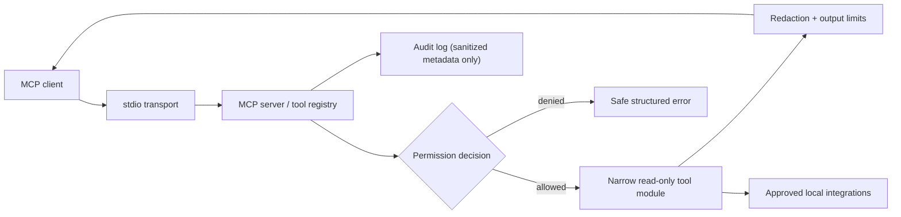

# Local MCP Toolbox

> A secure, local-first Model Context Protocol (MCP) server for inspecting and troubleshooting development environments without granting an AI assistant unrestricted machine access.

## Status

This repository has completed **Phase 5 — CLI and Docker Deployment** and is ready for **Phase 6 — Documentation and Demo**. The server runs over stdio with startup policy validation, audited protocol requests, safe metadata resources, reusable safety prompts, and narrowly scoped read-only inspection tools.

The Version 1 inspection modules now include safe system metadata, approved-root filesystem inspection, explicit-allowlist Git inspection, opt-in Docker metadata, health, and bounded-log inspection, dedicated approved-root log analysis, a fixed-command Bandit adapter, top-level infrastructure detection, and deterministic incident evidence tools.

### Implemented foundation

- Strict Pydantic configuration models with YAML loading and profile invariants
- Canonical approved-root filesystem authorization, blocked sensitive-file patterns, and integration gating
- Central redaction for common credentials, keys, tokens, connection passwords, and optional privacy identifiers
- Structured, client-safe response and error contracts
- Sanitized append-only JSONL audit events with request metadata, timing, permission decision, and redaction count
- Unit and adversarial regressions for configuration, path traversal, sensitive paths, extension restrictions, integration denial, redaction, and audit leakage
- MCP stdio transport with a subprocess integration test, safe MCP resources/prompts, and audited protocol requests
- Read-only system metadata and approved-root filesystem listing, metadata, and redacted text reads
- Read-only Git status, branch, recent-commit, and diff-summary inspection using fixed argument templates
- Opt-in Docker container metadata, health, and bounded recent-log inspection through the official SDK
- Dedicated approved-root log tails, literal search, and deterministic error grouping with redaction
- Security-scanner availability inventory and normalized Bandit findings from separate approved roots
- Top-level project-type detection and infrastructure configuration inventory from separate approved roots
- Incident timeline extraction and evidence-only summaries from separate approved log roots

## Why this project exists

AI assistants are useful at diagnosing infrastructure and code, but a generic shell tool or unrestricted Docker socket turns a helpful integration into a high-privilege control plane. Local MCP Toolbox is designed to expose narrow, typed, auditable, read-only capabilities instead: inspect a repository, summarize logs, review Docker state, and identify risky configuration.

## Version 1 scope

Version 1 delivers the secure read-only core:

- MCP stdio server and Typer CLI
- Permission profiles, path containment, output limits, structured errors, audit records, and centralized redaction
- System, filesystem, Git, Docker, logs, security-scanner, infrastructure-inventory, and incident-summary modules
- Native and Docker deployment, tests, and client configuration examples

GitHub, Kubernetes, local-LLM, HTTP transport, dashboard, and all write operations are deliberately deferred. See [ROADMAP.md](ROADMAP.md).

## Architecture



All analyzed content is untrusted data. Tool modules never interpret file, log, issue, label, or commit content as instructions.

## Security model

- **Deny by default:** the `restricted` profile permits only configured filesystem roots and no integrations.
- **Read-only Version 1:** no generic command execution, mutations, stop/restart operations, commits, or remote tool execution.
- **Narrow interfaces:** every tool has typed, validated inputs; external binaries (when needed) use fixed argument templates and no shell.
- **Data minimization:** canonical path checks, symlink-escape prevention, blocked sensitive patterns, result limits, and redaction happen before output.
- **Accountability:** every request writes a sanitized JSONL audit event. Secrets are never written to audit logs.

See [docs/security-model.md](docs/security-model.md), [docs/threat-model.md](docs/threat-model.md), and [docs/adr/](docs/adr/).

## Proposed layout

```text
src/mcp_toolbox/
  server/        MCP lifecycle and modular registration
  tools/         Narrow read-only tool domains
  permissions/   Profile and integration authorization
  redaction/     Sensitive-data detection and fingerprints
  audit/         Sanitized JSONL audit events
  config/        Typed settings loading
  models/        Shared response and error contracts
  resources/     Safe MCP resources
  prompts/       Reusable safe MCP prompts
  cli/           Operator-facing commands
tests/           Unit, integration, and security regressions
config/          Restricted, standard, and example profiles
docs/            Architecture, threat model, ADRs, and operating guides
examples/        MCP-client configuration examples
demo/            Explicitly non-production test fixtures
```

## Engineering decisions

- Read-only by default makes the security boundary understandable and contains the blast radius.
- Generic shell execution is prohibited because validation cannot reliably make arbitrary command execution safe.
- Local AI is preferred for later summarization features so sensitive logs do not leave the machine by default.
- Docker socket access is opt-in and will be documented as a privilege boundary, not treated as routine plumbing.
- Untrusted content will be labeled in response envelopes to reduce prompt-injection risk.
- Audit logging and redaction are cross-cutting services, not optional behavior added per tool.
- Deterministic collection/parsing remains separate from any future AI-generated explanation.

## Quick start

Python 3.12+ is required. The restrictive profile starts with server metadata and safe system inspection only; filesystem access needs explicit roots, and Docker, Git, logs, scanners, and infrastructure modules need their own explicit opt-in configuration.

```powershell
python -m venv .venv
.\.venv\Scripts\python -m pip install -e ".[dev,docker]"
.\.venv\Scripts\local-mcp-toolbox doctor --config config\restricted.yml
.\.venv\Scripts\local-mcp-toolbox serve --config config\restricted.yml
```

`doctor` validates configuration and reports non-mutating prerequisite checks. See [getting started](docs/getting-started.md) for a generic stdio client configuration.

## Current tool catalog

| Module | Tools | Guardrails |
| --- | --- | --- |
| Server | `toolbox_server_status` | Server-generated metadata only. |
| System | `system_info`, `disk_usage`, `installed_developer_tools` | Standard-library metadata only; no environment-variable or process command-line exposure. |
| Filesystem | `filesystem_list_directory`, `filesystem_file_metadata`, `filesystem_read_text_file` | Canonical approved-root containment, sensitive-file blocklist, extension allowlist, file/result limits, and redaction. |
| Git | `git_repository_status`, `git_current_branch`, `git_recent_commits`, `git_diff_summary` | Explicit integration plus exact repository allowlist; fixed non-interactive Git arguments, no shell, time/output bounds, and redaction. |
| Docker | `docker_list_containers`, `docker_container_details`, `docker_container_logs`, `docker_unhealthy_containers` | Explicit opt-in; official SDK only; no lifecycle, exec, image, network, volume, label, mount, environment, or command access; bounded output and redaction. |
| Logs | `logs_tail_file`, `logs_search`, `logs_error_summary` | Separate explicit log roots; extension/blocklist checks, bounded files/records, literal-only search, secret redaction, and evidence-only summaries. |
| Security | `security_scanner_inventory`, `security_scan_repository` | Explicit scanner opt-in and separate roots; a fixed `bandit -q -r <approved-root> -f json` template, no shell, timeout/output bounds, normalized/redacted findings, and no automatic fixes. |
| Infrastructure | `infra_detect_project_types`, `infra_configuration_inventory` | Explicit separate roots; marker names and top-level configuration names only—no file-content reads or recursive traversal. |
| Incident | `incident_extract_timeline`, `incident_summarize_evidence` | Explicit separate log roots; bounded/redacted evidence only, timestamp extraction, no causal claims, and no AI dependency. |

See [tool catalog](docs/tools.md) for parameters and output behavior.

## Documentation

- [Architecture](docs/architecture.md)
- [Security model](docs/security-model.md)
- [Threat model](docs/threat-model.md)
- [Permissions](docs/permissions.md)
- [Getting started](docs/getting-started.md)
- [Container deployment](docs/docker.md)
- [Tool catalog](docs/tools.md)
- [Roadmap](ROADMAP.md)
- [Contributing](CONTRIBUTING.md)
- [Security reporting](SECURITY.md)

## Why This Project Matters

This project demonstrates how to connect AI systems to real developer environments without equating "useful" with "unrestricted." It combines MCP protocol design, least-privilege authorization, DevOps diagnostics, redaction, auditing, container safety, and testable operational tooling.

## License

MIT. See [LICENSE](LICENSE).
