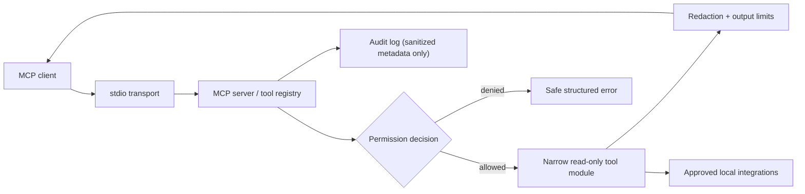

# Local MCP Toolbox

> A secure, local-first Model Context Protocol (MCP) server for inspecting and troubleshooting development environments without granting an AI assistant unrestricted machine access.

## Status

This repository has completed **Phase 2 — Secure Core Foundation**. The MCP server and tool modules have not yet been registered; Phase 3 will add the stdio server, safe resources, and reusable prompts.

### Implemented foundation

- Strict Pydantic configuration models with YAML loading and profile invariants
- Canonical approved-root filesystem authorization, blocked sensitive-file patterns, and integration gating
- Central redaction for common credentials, keys, tokens, connection passwords, and optional privacy identifiers
- Structured, client-safe response and error contracts
- Sanitized append-only JSONL audit events with request metadata, timing, permission decision, and redaction count
- Unit and adversarial regressions for configuration, path traversal, sensitive paths, extension restrictions, integration denial, redaction, and audit leakage

## Why this project exists

AI assistants are useful at diagnosing infrastructure and code, but a generic shell tool or unrestricted Docker socket turns a helpful integration into a high-privilege control plane. Local MCP Toolbox is designed to expose narrow, typed, auditable, read-only capabilities instead: inspect a repository, summarize logs, review Docker state, and identify risky configuration.

## Version 1 scope

Version 1 delivers the secure read-only core:

- MCP stdio server and Typer CLI
- Permission profiles, path containment, output limits, structured errors, audit records, and centralized redaction
- System, filesystem, Git, Docker, logs, security-scanner, infrastructure-inventory, and incident-summary modules
- Native and Docker deployment, tests, and client configuration examples

GitHub, Kubernetes, local-LLM, HTTP transport, dashboard, and all write operations are deliberately deferred. See [ROADMAP.md](ROADMAP.md).

## Architecture



All analyzed content is untrusted data. Tool modules never interpret file, log, issue, label, or commit content as instructions.

## Security model

- **Deny by default:** the `restricted` profile permits only configured filesystem roots and no integrations.
- **Read-only Version 1:** no generic command execution, mutations, stop/restart operations, commits, or remote tool execution.
- **Narrow interfaces:** every tool has typed, validated inputs; external binaries (when needed) use fixed argument templates and no shell.
- **Data minimization:** canonical path checks, symlink-escape prevention, blocked sensitive patterns, result limits, and redaction happen before output.
- **Accountability:** every request writes a sanitized JSONL audit event. Secrets are never written to audit logs.

See [docs/security-model.md](docs/security-model.md), [docs/threat-model.md](docs/threat-model.md), and [docs/adr/](docs/adr/).

## Proposed layout

```text
src/mcp_toolbox/
  server/        MCP lifecycle and modular registration
  tools/         Narrow read-only tool domains
  permissions/   Profile and integration authorization
  redaction/     Sensitive-data detection and fingerprints
  audit/         Sanitized JSONL audit events
  config/        Typed settings loading
  models/        Shared response and error contracts
  resources/     Safe MCP resources
  prompts/       Reusable safe MCP prompts
  cli/           Operator-facing commands
tests/           Unit, integration, and security regressions
config/          Restricted, standard, and example profiles
docs/            Architecture, threat model, ADRs, and operating guides
examples/        MCP-client configuration examples
demo/            Explicitly non-production test fixtures
```

## Engineering decisions

- Read-only by default makes the security boundary understandable and contains the blast radius.
- Generic shell execution is prohibited because validation cannot reliably make arbitrary command execution safe.
- Local AI is preferred for later summarization features so sensitive logs do not leave the machine by default.
- Docker socket access is opt-in and will be documented as a privilege boundary, not treated as routine plumbing.
- Untrusted content will be labeled in response envelopes to reduce prompt-injection risk.
- Audit logging and redaction are cross-cutting services, not optional behavior added per tool.
- Deterministic collection/parsing remains separate from any future AI-generated explanation.

## Planned quick start

The commands below become available after the MCP server is implemented:

```powershell
uv sync --extra dev
uv run local-mcp-toolbox doctor
uv run local-mcp-toolbox serve --config config/restricted.yml
```

## Documentation

- [Architecture](docs/architecture.md)
- [Security model](docs/security-model.md)
- [Threat model](docs/threat-model.md)
- [Permissions](docs/permissions.md)
- [Roadmap](ROADMAP.md)
- [Contributing](CONTRIBUTING.md)
- [Security reporting](SECURITY.md)

## Why This Project Matters

This project demonstrates how to connect AI systems to real developer environments without equating "useful" with "unrestricted." It combines MCP protocol design, least-privilege authorization, DevOps diagnostics, redaction, auditing, container safety, and testable operational tooling.

## License

MIT. See [LICENSE](LICENSE).
