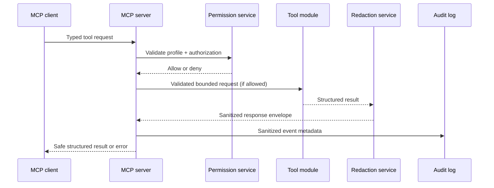

# Architecture

## Boundary model

The MCP server is a policy-enforcement point, not a generic automation gateway. Every request follows the same boundary sequence:

## Components

| Component | Responsibility | Security invariant |
| --- | --- | --- |
| Transport | MCP stdio lifecycle | Stdio is default; network transport is opt-in later. |
| Tool registry | Modular registration and capability discovery | Disabled modules are not registered. |
| Permission service | Profile, root, integration, and operation decisions | Ambiguous requests are denied. |
| Tool modules | Typed, narrow read-only data collection | No generic shell or mutation tool exists. |
| Redaction service | Detect, replace, and fingerprint sensitive data | Original secret material is not returned or audited. |
| Audit service | JSONL event records and retention | Stores sanitized summaries, not raw tool content. |
| Configuration | Validated profile loading | Configuration cannot silently elevate access. |

## Current MCP surface

Phase 3 supports stdio only. Startup first loads the explicit YAML profile, validates it, resolves approved roots, and composes the permission, redaction, and audit services. If validation fails, the CLI reports a safe configuration error on stderr and exits before the MCP protocol starts.

The current MCP surface intentionally contains only server-generated capabilities:

- `toolbox_server_status` — read-only server metadata; it never inspects the host.
- `toolbox://server/status`, `toolbox://configuration/summary`, `toolbox://security/policy`, and `toolbox://modules` resources.
- `analyze_repository`, `summarize_recent_errors`, `troubleshoot_container`, and `perform_security_review` safe prompt templates.

Every MCP request is recorded through audit middleware. The middleware sends only sanitized parameters to the JSONL audit logger; audit records never include raw secrets or tool output.

## Version 1 module order

1. Foundation: settings, permissions, redaction, auditing, response contracts
2. MCP server: stdio registration, resources, prompts, startup checks
3. Tools: system, filesystem, Git, Docker, logs, scanner adapters, infrastructure, incident summaries
4. Operations: CLI, doctor, Docker packaging
5. Quality: demo, docs, CI, release controls

## Non-goals

Version 1 does not mutate infrastructure, run arbitrary commands, write documentation files, access secret values, or expose an unauthenticated network listener.
