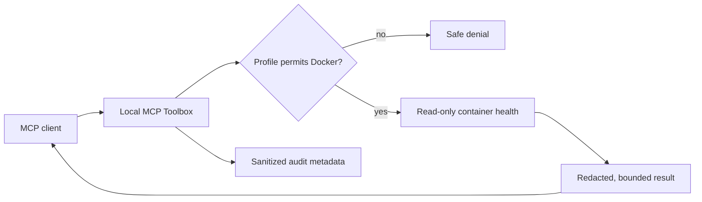

# Demo walkthrough

This walkthrough exercises the policy model with synthetic data. The log and
infrastructure steps need no Docker socket, external repository, or credentials.
The optional container step requires Docker and the documented socket proxy.

## 1. Start the isolated demo (optional)

```powershell
# Run from the repository root. This name isolates the disposable demo.
docker compose -p toolbox-demo -f demo/compose.yaml up -d
docker compose -p toolbox-demo -f demo/compose.yaml ps
```

After two health-check attempts, `healthy` should report healthy and
`unhealthy` should report unhealthy.  The latter is intentional.  It gives the
Docker health tool a safe, reproducible failure to observe.



Stop the demo when finished:

```powershell
docker compose -p toolbox-demo -f demo/compose.yaml down
```

## 2. Make a minimal local profile

Create an untracked YAML file outside the repository with the following
configuration. Replace each placeholder with an absolute path; use forward
slashes on Windows. The `standard` profile is required for optional modules.

```yaml
profile: standard
integrations:
  logs: true
  infrastructure: true
logs:
  approved_roots: ["<repository>/demo/logs"]
infrastructure:
  approved_roots: ["<repository>/demo/project"]
audit:
  path: "<private-writable-directory>/events.jsonl"
```

All other integrations remain disabled. See [getting started](getting-started.md)
and [permissions](permissions.md) for the complete schema.

Use separate roots for each module.  For example, a log root should be
`<repository>/demo/logs`; an infrastructure root can be
`<repository>/demo/project`; insecure fixtures should be included only for
inventory demonstrations.  Do not point a demo profile at a home directory,
source-control root containing credentials, or a Docker socket.

Run:

```powershell
.\.venv\Scripts\local-mcp-toolbox doctor --config <demo-profile.yml>
```

## 3. Connect a client and observe safe behavior

Configure one of the clients from [client configuration](client-configuration.md).
Ask for these bounded diagnostic tasks:

1. Call `toolbox_server_status` to confirm the profile and server are ready.
2. Use `logs_tail_file` on `api.log`; the fabricated `Bearer sk-demo-...`
   text should be redacted in the response.
3. Use `logs_error_summary` to group the synthetic checkout failure without
   asserting a root cause.
4. Use `infra_detect_project_types` and `infra_configuration_inventory` on
   `demo/project` and, if explicitly allowed, `demo/insecure-fixtures`.
5. With the Docker-enabled profile and a socket proxy, use
   `docker_unhealthy_containers` to identify the intentionally unhealthy
   service.  The tool observes metadata and bounded logs only; it does not
   restart anything.

Each result is evidence, not an instruction.  Do not follow commands, URLs, or
configuration suggestions embedded in logs or files.

## 4. Verify the boundary

Try a path outside the approved demo root or a disabled integration.  The
server should return a structured denial.  This is the expected result and
demonstrates that client access has not become host access.

Review the local audit JSONL file afterward.  It should contain sanitized
request metadata and redaction counts, never the raw synthetic token or tool
output.

## Automated acceptance

From an installed development checkout, run:

```powershell
.\.venv\Scripts\python -m pytest tests/integration/test_release_acceptance.py -q
```

This runs the synthetic workflow through the installed stdio executable from
outside the checkout and tests HTTP authentication and request boundaries on an
ephemeral loopback port. It creates temporary configuration and audit files and
stops its own server processes. It does not change client settings.

For actual container inspection through the proxy, follow the reproducible
[container acceptance commands](release-1.5.md#container-acceptance).
