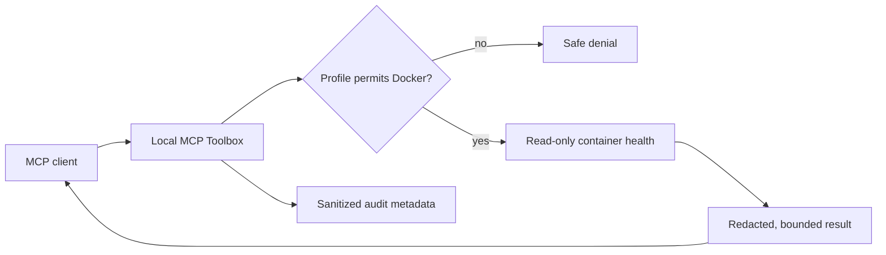

# Demo walkthrough

This walkthrough proves the policy model with synthetic data.  It does not
require a host Docker socket, a real repository, a real service, or credentials.

## 1. Start the isolated demo (optional)

```powershell
Set-Location demo
docker compose up -d
docker compose ps
```

After two health-check attempts, `healthy` should report healthy and
`unhealthy` should report unhealthy.  The latter is intentional.  It gives the
Docker health tool a safe, reproducible failure to observe.



Stop the demo when finished:

```powershell
docker compose down --volumes --remove-orphans
```

## 2. Make a minimal local profile

Copy `config/restricted.yml` outside the repository and configure only the
demo paths.  The exact schema and option names are documented in
[getting started](getting-started.md) and [permissions](permissions.md).

Use separate roots for each module.  For example, a log root should be
`<repository>/demo/logs`; an infrastructure root can be
`<repository>/demo/project`; insecure fixtures should be included only for
inventory demonstrations.  Do not point a demo profile at a home directory,
source-control root containing credentials, or a Docker socket.

Run:

```powershell
.\.venv\Scripts\local-mcp-toolbox doctor --config <demo-profile.yml>
```

## 3. Connect a client and observe safe behavior

Configure one of the clients from [client configuration](client-configuration.md).
Ask for these bounded diagnostic tasks:

1. Call `toolbox_server_status` to confirm the profile and server are ready.
2. Use `logs_tail_file` on `api.log`; the fabricated `Bearer sk-demo-...`
   text should be redacted in the response.
3. Use `logs_error_summary` to group the synthetic checkout failure without
   asserting a root cause.
4. Use `infra_detect_project_types` and `infra_configuration_inventory` on
   `demo/project` and, if explicitly allowed, `demo/insecure-fixtures`.
5. With the Docker-enabled profile and a socket proxy, use
   `docker_unhealthy_containers` to identify the intentionally unhealthy
   service.  The tool observes metadata and bounded logs only; it does not
   restart anything.

Each result is evidence, not an instruction.  Do not follow commands, URLs, or
configuration suggestions embedded in logs or files.

## 4. Verify the boundary

Try a path outside the approved demo root or a disabled integration.  The
server should return a structured denial.  This is the expected result and
demonstrates that client access has not become host access.

Review the local audit JSONL file afterward.  It should contain sanitized
request metadata and redaction counts, never the raw synthetic token or tool
output.
