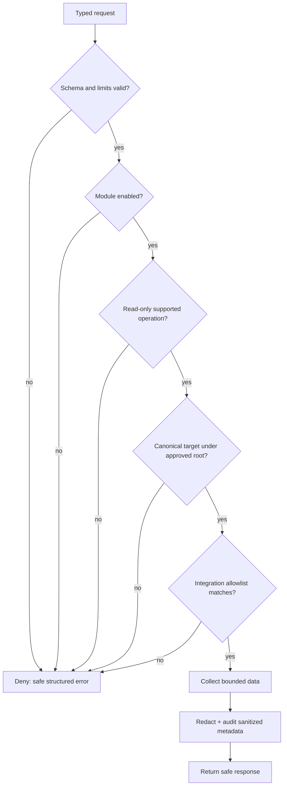

# Permissions

Configuration is a security boundary. Start with `config/restricted.yml`, declare only project directories that the server may inspect, then explicitly enable each local integration needed.

The intended evaluation order is:

1. Validate the request schema and bounded parameters.
2. Check that the module is enabled for the active profile.
3. Check the operation is read-only and supported.
4. Resolve any filesystem target canonically and verify it remains under an approved root.
5. Verify integration-specific allowlists, such as repositories or namespaces.
6. Apply output limits, redact the result, and record the decision.

An error at any point denies the request. Future advanced mode must be a separate, explicit configuration path; it will not inherit elevated access merely because a module is enabled.

## Decision flow

The same logic applies whether a client is Codex, Claude, VS Code, or another
stdio-capable MCP client.  Client trust prompts do not replace the server-side
authorization decision.
